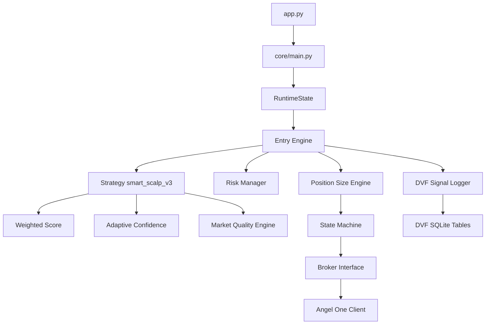

# PTQ Scalping Bot

Project Name: PTQ Scalping Bot  
Version: v3.5.0  
Status: RC2 Freeze Candidate  
Last Updated: 2026-07-24

RC2 freeze-candidate overview for the current codebase.

## Status
- RC1 completed.
- RC2 completed.
- Freeze Candidate prepared and pending final commit approval.

## What This System Does
PTQ Scalping Bot executes NIFTY options paper and live workflows with:
- modular entry and exit engines
- runtime shared state coordination
- market quality gating
- risk-budget based position sizing
- DVF (Decision Validation Framework) for validation telemetry and reports

## Runtime Architecture (RC2)



Detailed component documentation for RuntimeState, DVF, Market Quality, and Position Size is maintained in [DOCUMENTATION.md](DOCUMENTATION.md).

## Paper Trading Workflow
1. Run readiness checks.
2. Start paper mode with the launcher.
3. Stream runtime state and ticks.
4. Evaluate weighted score and adaptive confidence.
5. Apply market quality gate and position sizing.
6. Execute via broker interface and log DVF decision evidence.

## Daily Operation

Every command assumes the repository root as the working directory.

### Before a session

```bash
./venv/bin/python -c "from config.validator import validate_config; validate_config()"
```

Check `.env` **after** `validate_config()` has run, never from a fresh `config.constants`
import: the validator's loader writes straight into `os.environ`, so that is the only place the
effective values are visible.

### Start

```bash
./run.sh                      # menu launcher
./venv/bin/python app.py      # or start directly
```

### After the session closes

One command runs the whole post-session pipeline — session report, before/after comparison,
synthesis, experiment ledger, then the visual record, its page and the cross-session evidence
page — and prints a summary that leads with data quality rather than P&L:

```bash
./venv/bin/python -m research.after_session 2026-09-07   # or omit the date for the newest session
```

The same command is on the launcher at **[11] Research & Visual → [1] After-Session Pipeline**,
which lists the sessions discovered in the trade store and lets you pick one.

Where two experiments ran in the same session, separate them:

```bash
./venv/bin/python claude_code/experiments/exp10_postsession.py 2026-09-07
```

## Research Instruments

Two read-only layers over the trading database. Neither writes to it, neither changes strategy
behaviour, and both discover sessions from the data rather than from a hardcoded date.

Every command below is also reachable from the launcher under **[11] Research & Visual**, which
prints the command it runs so it can be copied back out to a shell.

### Visual record (`research/visual`)

A persisted record of every session — candles at 10s/30s/1m/5m/30m/1d, market legs, indicators,
strategy state, one row per evaluation, trade overlays and the capture cascade — with a
provenance of REAL, RECONSTRUCTED, ESTIMATED or MISSING on every field. Records live in
`core/data/visual_records.db`; nothing is fabricated where a source is absent.

```bash
./venv/bin/python -m research.visual audit                 # what the source data can support
./venv/bin/python -m research.visual list                  # what is persisted
./venv/bin/python -m research.visual backfill 2026-09-07   # build or rebuild one session
./venv/bin/python -m research.visual backfill              # every session that carries data
./venv/bin/python -m research.visual view 2026-09-07       # that session's page
./venv/bin/python -m research.visual view                  # every page, plus the index
./venv/bin/python -m research.visual compare               # cross-session evidence page
./venv/bin/python -m research.visual compare --print       # ...and the dimensions on stdout
```

Output lands in `claude_code/research_output/visual/` (gitignored):

```bash
xdg-open claude_code/research_output/visual/index.html
```

A rebuild is idempotent, and `research.after_session` builds the record for whatever day it
processes, so a future session needs no manual step.

### Research layer (`research/`)

```bash
./venv/bin/python -m research.session 2026-09-07          # one session, all layers
./venv/bin/python -m research.session 2026-09-07 --deep   # also price what each pre-filter blocked
./venv/bin/python -m research.compare_report 2026-09-04 2026-09-07
./venv/bin/python -m research.synthesis                   # the whole chain, end to end
./venv/bin/python -m research.experiment                  # the experiment ledger
```

Both layers are documented in [research/README.md](research/README.md).

## Reverting a Configuration Experiment

```bash
cp .env.bak-pre-tick-repair-20260904 .env    # tick delta/oi population off
cp .env.bak-pre-timefilter-20260904 .env     # the earlier time gates
```

`TRADING_END` must not be raised above **15:25**: `exit_engine` force-closes at 15:25, so an
entry taken after it exits on the next tick for the round-trip spread.

## India VIX Canonical Contract
Authoritative contract in code:
- exchange: NSE
- symbol: INDIAVIX
- token: 99926017

Defined in [config/constants.py](config/constants.py) and documented in [brokers/angel_one/DOCUMENTATION.md](brokers/angel_one/DOCUMENTATION.md).

## Configuration Model (Current)
Configuration is layered:
1. environment helpers and root path in [config/configuration.py](config/configuration.py)
2. env-backed constants in [config/constants.py](config/constants.py)
3. strategy and scoring defaults in [config/strategy.json](config/strategy.json)

Important:
- strategy scoring, market quality threshold, and position size engine config are driven from strategy.json and merged by strategy runtime.

## Installation
1. Clone repository.
2. Create and activate environment:

```bash
python3 -m venv venv
source venv/bin/activate
```

3. Install dependencies:

```bash
pip install -r requirements.txt
```

4. Configure environment:

```bash
cp .env.example .env
```

5. Run readiness check:

```bash
./run.sh --readiness --no-animation
```

Canonical launcher command policy:
- Use only ./run.sh for launcher actions.
- Do not use ./rin.sh (invalid command; returns command not found).

6. Run paper mode launch:

```bash
./run.sh
```

## Updated Project Layout (High-Level)
- [app.py](app.py)
- [run.sh](run.sh)
- [config](config)
- [core](core)
- [strategies](strategies)
- [brokers](brokers)
- [utils](utils)
- [research](research) — read-only research and visual record instruments
- [tests](tests)
- [archive](archive)

Detailed layout is maintained in [PROJECT_STRUCTURE.md](PROJECT_STRUCTURE.md).

## Test Status

```bash
./venv/bin/python -m pytest                              # the whole suite
./venv/bin/python -m pytest tests/test_visual_records.py  # the visual record layer
```

Current: **464 passed, 1 skipped, 0 failed**.

RC2 Freeze verification snapshot, kept for history: 151 passed, 1 skipped, 0 failed.

## MFE/MAE inspection
You can inspect the recent trade excursion summary directly with:

```bash
./venv/bin/python - <<'PY'
from core.validation.analytics import recent_sessions_trade_mfe_mae_summary
print(recent_sessions_trade_mfe_mae_summary(7))
PY
```

For a custom date window:

```bash
./venv/bin/python - <<'PY'
from core.validation.analytics import recent_sessions_trade_mfe_mae_summary
print(recent_sessions_trade_mfe_mae_summary(10, end_date='2026-08-10'))
PY
```

## Documentation Scope
This README is intentionally RC2-current and excludes legacy historical process narrative. Historical reports and freeze evidence live under [archive](archive).
