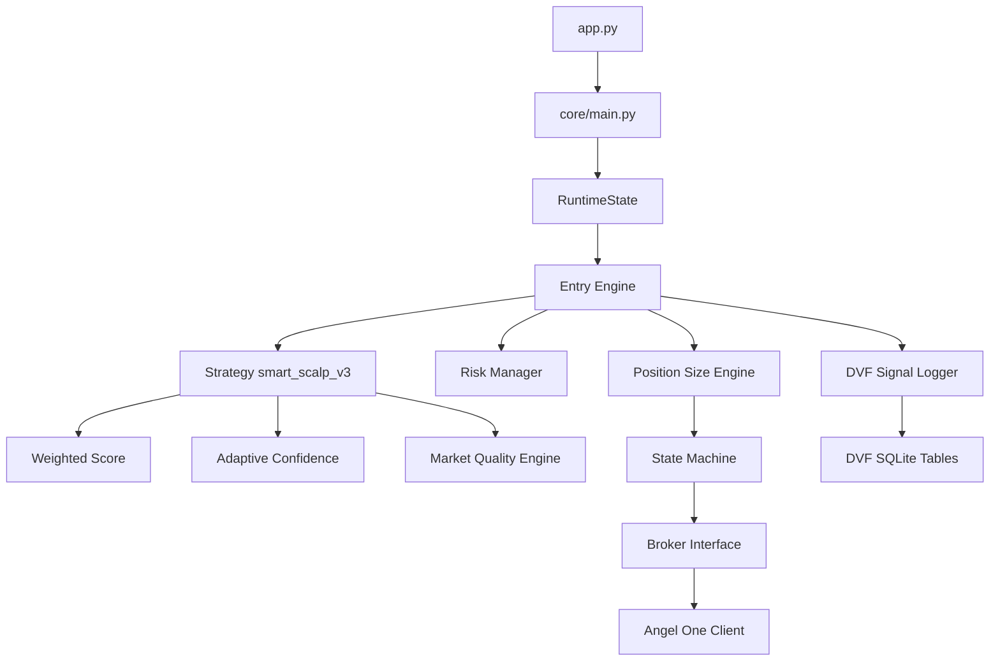

# PTQ Scalping Bot

Project Name: PTQ Scalping Bot  
Version: v3.5.0  
Status: RC2 Freeze Candidate  
Last Updated: 2026-07-24

RC2 freeze-candidate overview for the current codebase.

## Status
- RC1 completed.
- RC2 completed.
- Freeze Candidate prepared and pending final commit approval.

## What This System Does
PTQ Scalping Bot executes NIFTY options paper and live workflows with:
- modular entry and exit engines
- runtime shared state coordination
- market quality gating
- risk-budget based position sizing
- DVF (Decision Validation Framework) for validation telemetry and reports

## Runtime Architecture (RC2)



Detailed component documentation for RuntimeState, DVF, Market Quality, and Position Size is maintained in [DOCUMENTATION.md](DOCUMENTATION.md).

## Paper Trading Workflow
1. Run readiness checks.
2. Start paper mode with the launcher.
3. Stream runtime state and ticks.
4. Evaluate weighted score and adaptive confidence.
5. Apply market quality gate and position sizing.
6. Execute via broker interface and log DVF decision evidence.

## India VIX Canonical Contract
Authoritative contract in code:
- exchange: NSE
- symbol: INDIAVIX
- token: 99926017

Defined in [config/constants.py](config/constants.py) and documented in [brokers/angel_one/DOCUMENTATION.md](brokers/angel_one/DOCUMENTATION.md).

## Configuration Model (Current)
Configuration is layered:
1. environment helpers and root path in [config/configuration.py](config/configuration.py)
2. env-backed constants in [config/constants.py](config/constants.py)
3. strategy and scoring defaults in [config/strategy.json](config/strategy.json)

Important:
- strategy scoring, market quality threshold, and position size engine config are driven from strategy.json and merged by strategy runtime.

## Installation
1. Clone repository.
2. Create and activate environment:

```bash
python3 -m venv venv
source venv/bin/activate
```

3. Install dependencies:

```bash
pip install -r requirements.txt
```

4. Configure environment:

```bash
cp .env.example .env
```

5. Run readiness check:

```bash
./run.sh --readiness --no-animation
```

6. Run paper mode launch:

```bash
./run.sh
```

## Updated Project Layout (High-Level)
- [app.py](app.py)
- [run.sh](run.sh)
- [config](config)
- [core](core)
- [strategies](strategies)
- [brokers](brokers)
- [utils](utils)
- [tests](tests)
- [archive](archive)

Detailed layout is maintained in [PROJECT_STRUCTURE.md](PROJECT_STRUCTURE.md).

## Test Status
RC2 Freeze verification snapshot:
- 151 passed
- 1 skipped
- 0 failed

## Documentation Scope
This README is intentionally RC2-current and excludes legacy historical process narrative. Historical reports and freeze evidence live under [archive](archive).
