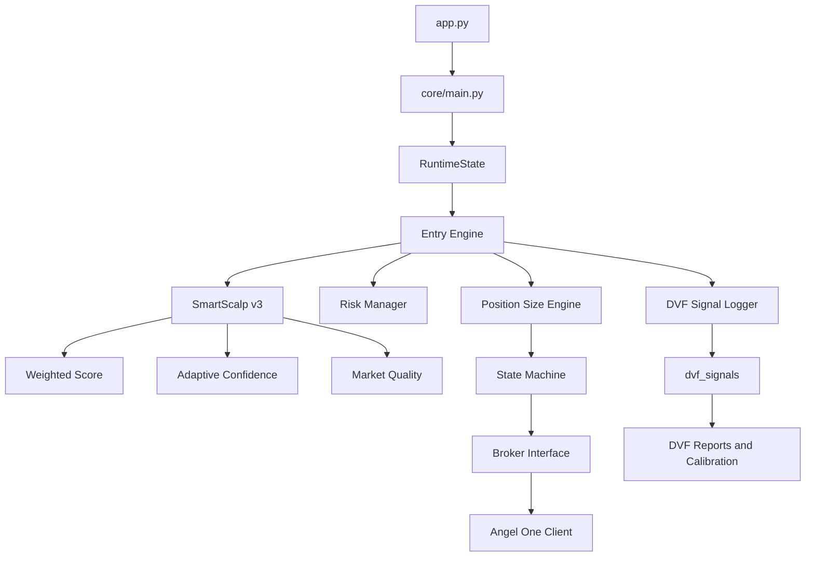

# P0 Final Freeze Documentation (RC2 Aligned)

## Freeze Status
- P0 implementation stack: complete in repository
- RC1 technical verification completed.
- RC2 operational verification completed (pre-release).
- Freeze Candidate: in final pre-commit review.

## Architecture (Current)

Design invariant:
- DVF remains validation-focused and does not change core trade decisions.

## RuntimeState
RuntimeState is a first-class runtime component in [core/runtime/state.py](core/runtime/state.py).

Responsibilities:
- rolling recent tick buffer
- derived candle history
- indicator cache
- market and broker snapshots
- session telemetry and counters

Integrated in runtime and strategy layers:
- [core/main.py](core/main.py)
- [core/engines/entry_engine.py](core/engines/entry_engine.py)
- [core/engines/state_machine.py](core/engines/state_machine.py)
- [core/services/mode_switch.py](core/services/mode_switch.py)
- [strategies/smart_scalp_v3.py](strategies/smart_scalp_v3.py)

## Market Quality Gate
Implemented in [core/engines/market_quality_engine.py](core/engines/market_quality_engine.py).

Current model:
- weighted scoring components (spread, liquidity, freshness, volatility, execution, greeks, session)
- hard reject checks for invalid/trading-unsafe context
- threshold-based pass/fail consumed by strategy before order path

## Position Size Engine
Implemented in [core/engines/position_size_engine.py](core/engines/position_size_engine.py), consumed in [core/engines/state_machine.py](core/engines/state_machine.py).

Current behavior:
- resolves risk budget into executable lots and quantity
- applies context multipliers and clamped allocation
- enforces max lot and risk caps
- returns structured breakdown for validation and analytics

## DVF Stack
Modules:
- [core/validation/signal_logger.py](core/validation/signal_logger.py)
- [core/validation/paper_executor.py](core/validation/paper_executor.py)
- [core/validation/decision_replay.py](core/validation/decision_replay.py)
- [core/validation/calibration_engine.py](core/validation/calibration_engine.py)
- [core/validation/validation_report.py](core/validation/validation_report.py)
- [core/validation/exporter.py](core/validation/exporter.py)

Persistence:
- [core/services/database.py](core/services/database.py)
- dvf_signals, dvf_trades, dvf_reports, dvf_calibration

## Configuration Model (Current)
Configuration is split across:
- [config/configuration.py](config/configuration.py): environment helper functions and root path
- [config/constants.py](config/constants.py): env-backed runtime constants
- [config/strategy.json](config/strategy.json): strategy scoring and position-size configuration

## India VIX Contract
Canonical runtime contract:
- exchange NSE
- symbol INDIAVIX
- token 99926017

Referenced by:
- [config/constants.py](config/constants.py)
- [utils/helpers.py](utils/helpers.py)
- [brokers/angel_one/DOCUMENTATION.md](brokers/angel_one/DOCUMENTATION.md)

## Test and Validation Baseline
RC2 Freeze verification snapshot:
- 151 passed
- 1 skipped
- 0 failed

RC2-focused groups include:
- websocket and confidence behavior
- market quality behavior
- DVF signal and pipeline
- position size engine and integration
- readiness and validator config

## RC2 Freeze Decision
This repository state is documentation-aligned for RC2 freeze commit preparation.

Conditions retained:
- no production code edits in documentation step
- archive records preserved as evidence
- final commit remains manual approval controlled
